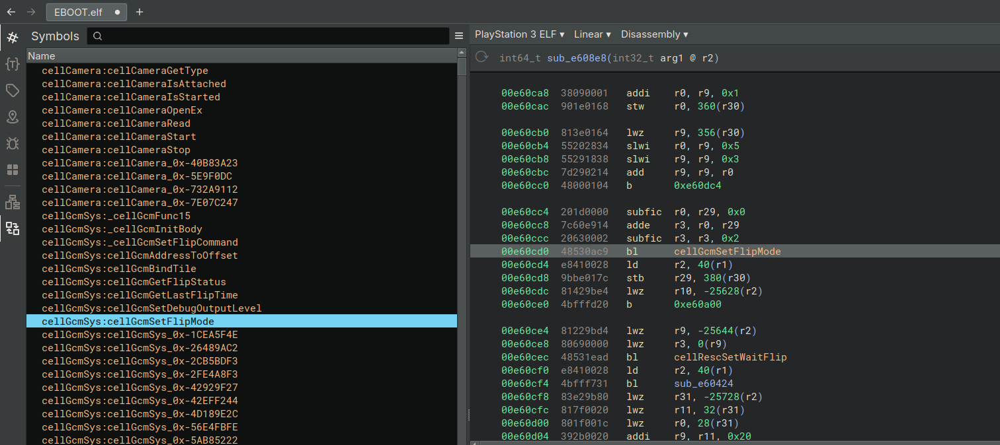

# bninja-ps3

Work-in-process Cell PPU (*Playstation 3*) ELF loader for Binary Ninja `4.x`. Only supports decrypted PS3 executable ELFs `EBOOT.BIN`.

Tested with Binary Ninja:
* `4.1.5902-stable`
* `4.2.6455-stable`

# Usage

1. Clone this repo to `~/.binaryninja/plugins/`
1. Open bninja and load a PS3 executable
1. Select "Playstation 3 ELF" binary view

## Syscalls

To define syscalls:

1. Right-click anywhere 
1. `Plugins`
1. `ps3-syscall-sweep`

Syscalls will then appear under `System types`. Code references might be incomplete if run before analysis can finish or where decompilation fails.

# Known Issues

* DWARF symbols are not recognized
* library import definitions don't have arguments
* system call definitions don't have arguments
* system calls are not registered with platform/system and thus are not lifted
* not tested on ELFs with multiple TOCs
* bninja does not lift many PPC instructions, breaking decompilation

Non-exhaustive list of unsupported instructions:
```
clrldi
lfs
fcmpu
stfs
lfd
fmuls
fadds
fmadds
fdivs
mtocrf
frsp
fcfid
cmpdi
fmr
stfd
vmaddfp
psq_lx
stvx
```

## License

This plugin is released under an [MIT license](./license).

## Resources

* https://www.psdevwiki.com/ps3/SELF_-_SPRX
* http://www.openwatcom.com/ftp/devel/docs/elf-64-gen.pdf
* https://refspecs.linuxfoundation.org/ELF/ppc64/PPC-elf64abi.html
* https://refspecs.linuxfoundation.org/elf/gabi4+/ch4.eheader.html
* https://github.com/clienthax/Ps3GhidraScripts
* https://github.com/RPCS3/rpcs3/
* https://binary.ninja/2020/01/08/guide-to-architecture-plugins-part1.html
* https://gist.github.com/xerpi/4aaf83ca59c33190c960881e3a364627#file-nidreader-py
* https://www.psdevwiki.com/ps3/PRX#PS3